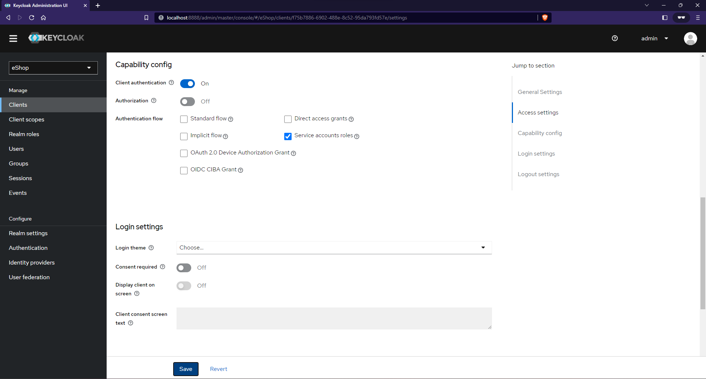
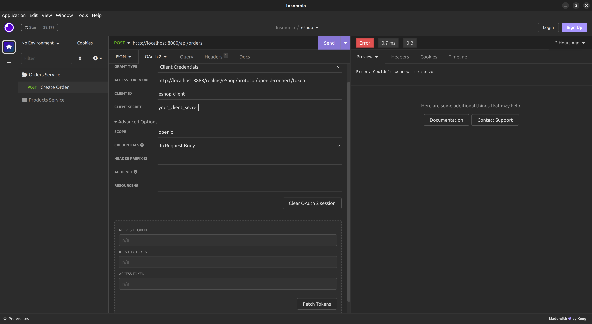

# eShop

Demo application for demonstrating the microservices architecture using Spring Boot.

_This document is incomplete._

# Getting Started

Make sure you have [Docker](https://docs.docker.com/engine/install/) installed on your machine.

Look through the [compose](./compose.yaml) file to ensure you have the following ports
available on your machine:

1. 9092 (Apache Kafka)
2. 9411 (Zipkin)
3. 8888 (Keycloak)
4. 27017 (MongoDB)
5. 3306 (MySQL)
6. 8080 (API Gateway)

Create the containers:

``` sh
docker compose up --detach
```

## Create the Inventory & Orders Databases in MySQL:

``` sh
docker exec -it eshop_mysql_db mysql -p
```

Enter the password for MySQL when prompted:

``` sh
password123456
```

Create the DBs:

``` sql
CREATE DATABASE eshop_inventory;
CREATE DATABASE eshop_orders;
```

Logout of MySQL:

``` sh
exit
```

# Keycloak

To protect the services, we must first set up the Keycloak server. Start by logging
into the [Keycloak Administration Console](http://localhost:8888/admin/master/console).

The default username and password are `admin` and `password123456`, respectively.

Create a realm named `eShop` and a client (within the realm) named `eshop-client`.
Visit the [Getting Started](https://www.keycloak.org/getting-started/getting-started-docker) page
with Keycloak to create a realm and a client.

When creating the client, make sure to use the 
[Client Credentials Flow](https://auth0.com/docs/get-started/authentication-and-authorization-flow/client-credentials-flow).

The client configuration should look like this:



## Getting an Access Token

From the Keycloak Admin Console, navigate to the Realm Settings section, 
scroll down until you "Endpoints" and open the
[OpenID Endpoint Configuration](http://localhost:8888/realms/eShop/.well-known/openid-configuration).
You need to provide the `Client ID` (eshop-client) and the `Client Secret` to the
[access_token](http://localhost:8888/realms/eShop/protocol/openid-connect/token) endpoint:

```shell
curl --data 'grant_type=client_credentials&scope=openid&client_id=eshop-client&client_secret=your_client_secret' \
http://localhost:8888/realms/eShop/protocol/openid-connect/token | json_pp
```

You should get a response that resembles the following:

```json
{
   "access_token" : "your_access_token",
   "expires_in" : 300,
   "id_token" : "your_id_token",
   "not-before-policy" : 0,
   "refresh_expires_in" : 0,
   "scope" : "openid email profile",
   "token_type" : "Bearer"
}
```

### Using a REST Client

You can use [Insomnia](https://insomnia.rest/download), or whichever REST client you wish,
to handle fetching the access tokens. Insomnia will automatically attach the 
access token to every subsequent request.




# Start the Microservices

First, start the Eureka discovery server through your IDE, or from a CLI:

``` sh
cd PROJECT_ROOT/discovery-server
./gradlew bootRun
```

Second, start the API gateway:

``` sh
cd PROJECT_ROOT/api-gateway
./gradlew bootRun
```

The remaining service can be started in any order.

## Eureka Dashboard

You can view the Eureka dashboard at [http://localhost:8080/eureka/web](http://localhost:8080/eureka/web).

The default username and password are `eureka` and `password`, respectively.

# Observability with Micrometer and Zipkin

In Spring Boot 3, the Spring team introduced the [Observation API](https://spring.io/blog/2022/10/12/observability-with-spring-boot-3).


# Apache Kafka

## View Events

```shell
docker exec -it broker kafka-console-consumer --topic order_notifications --from-beginning --bootstrap-server localhost:9092
```